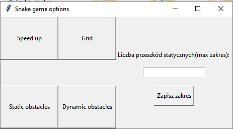
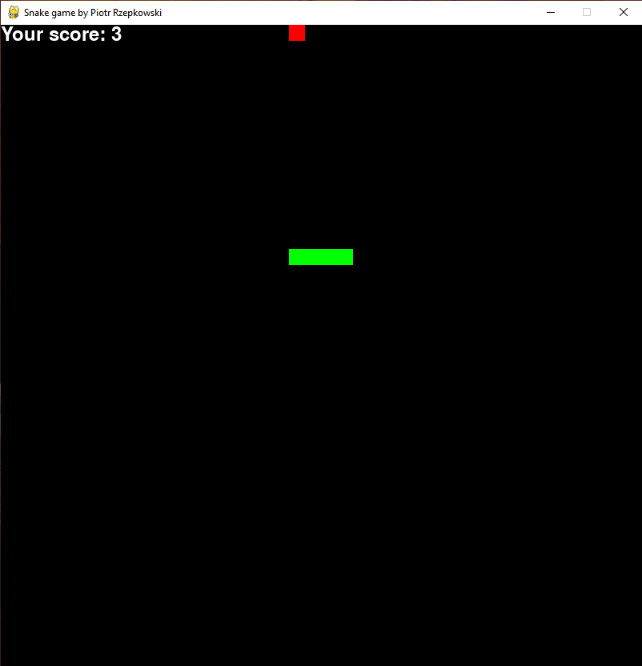
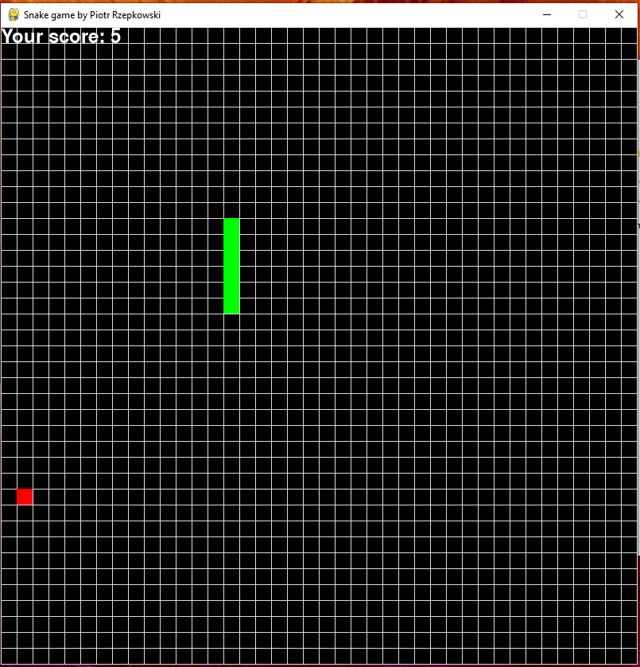
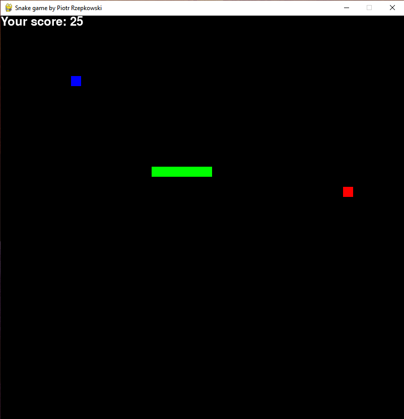
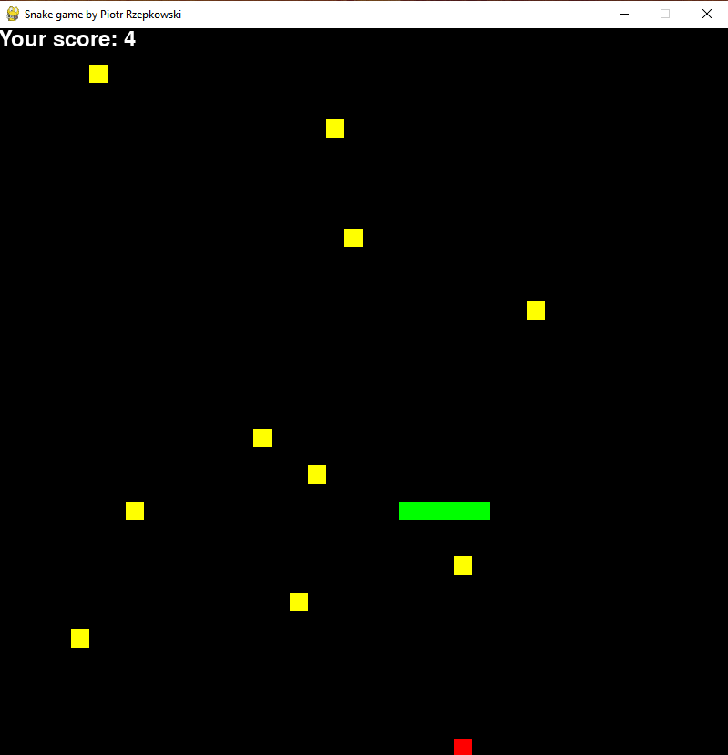
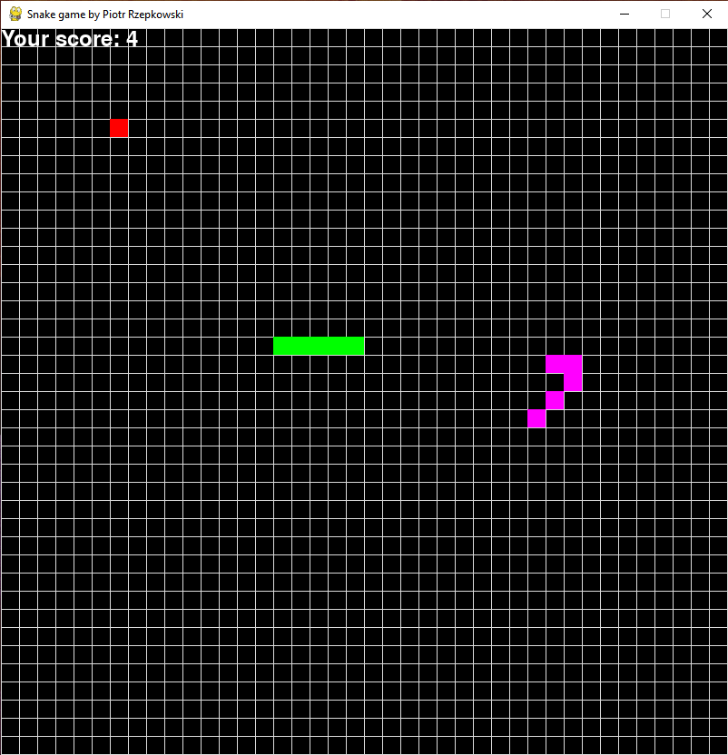

# snake-game-python
Simple snake game written in Python with options menu to customize the game.


## Table of contents
* [General info](#general-info)
* [Technologies](#technologies)
* [Images](#images)
* [Setup](#setup)

## General info
Game is written in OOP concept in mind, with Grid, Snake and Menu being represented as classes, containing methods which influence their behaviour. Composed together, they're main fundamentals of the game.

## Technologies
Project is created with:</br>
Python Release Python 3.4.0+</br>
Pygame module [website](https://www.pygame.org/news)<br>
Python Imaging Library PIL [website](https://pillow.readthedocs.io/en/stable/)</br>
Abstract Base Classes module [link] (https://docs.python.org/3/library/abc.html)</br>

## Images
Small menu with various customization options<br/>
The game opens after settings options (or leaveing them empty) and clicking x in right top corner.</br>


Without any options -> "raw" gameplay &nbsp; &nbsp; &nbsp; &nbsp; &nbsp; &nbsp; &nbsp; &nbsp; &nbsp; &nbsp; &nbsp; &nbsp; &nbsp; &nbsp; &nbsp; &nbsp; &nbsp; &nbsp; &nbsp; &nbsp; &nbsp; &nbsp; &nbsp; &nbsp; &nbsp;With Grid setting on<br/>
 

With speed up bonus - each blue square increase pace of the game &nbsp; &nbsp; &nbsp; &nbsp; With static obstacles and range set to 10<br/>
&nbsp;

With dynamic obstacles enabled - enemy snake grows as you eat more apples!<br/>



## Setup 

To run this project, navigate to the directory where you want to put your repository (Change the test-repo to the location where you want the cloned directory) and use:

```
cd test-repo
gh repo clone piotr-rzepa/snake-game-python
```

After that, you are able to open project in your favourite IDE (ensuring that you have python interpreter installed on your machine) and run __init__.py to open settings menu and then the game itself. :+1:.
